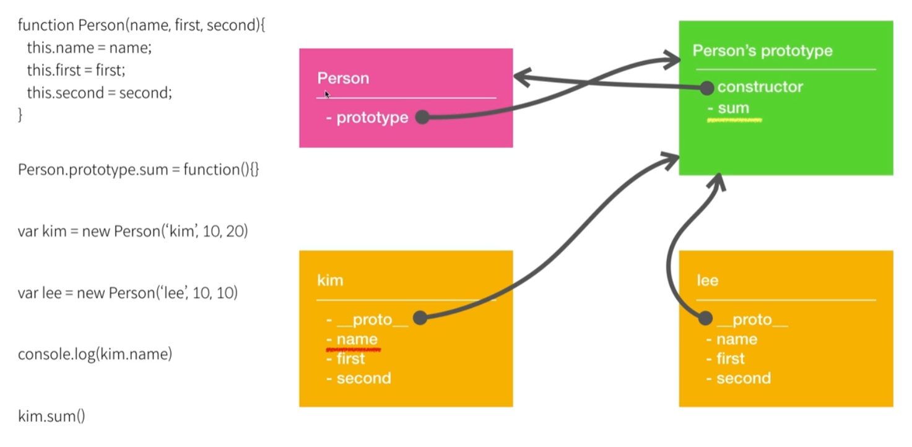
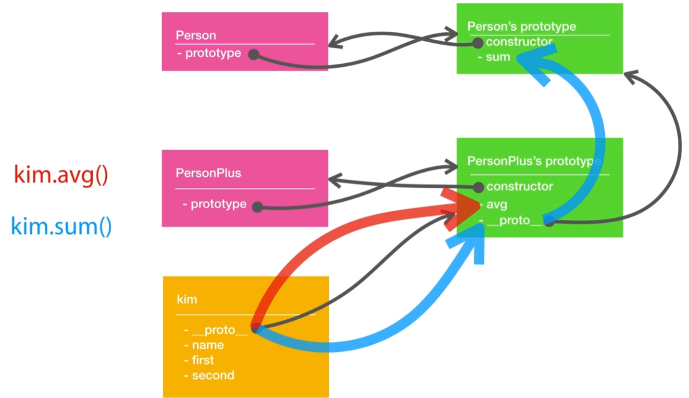

# 20220220 JAVA 객체


### #11_상속


```JS
class PersonPlus extends Person{
  avg(){
    return (this.first+this.second)/2;
  }
}
```

* PersonPlus에 Person이 상속된다.


Q1) 상속이랑 무엇인가요?

A1) 상속은 한 클래스의 동일한 속성, 코드를 다른 클래스에 가져오는 행위이다.


Q2) 상속이 없으면 어떤 점이 불편한가요?

A2) 동일한 기능을 하는 함수, 변수들을 클래스를 생성시 마다 계속 적어야한다.


Q3) 상속을 받는 자식 클래스를 구현하려면 어떻게 해야 하나요?

A3) 

```js
class child extends parent{
    
}
```


### #12_super


상속받은 클래스에 추가적인 속성, 인자를 부여할 때 사용

* 생성자 호출

  ```js
  super()
  ```

  

* 부모클래스

```js
super.sum()
```


Q1) super의 두 가지 용법에 대해서 말해보세요.

* 생성자를 호출하여 속성을 가져온다.
* 부모클래스를 호출한다.


Q2) super이 없다면 우리는 어떤 불편함이 있고 super가 있을 때는 어떤 편리함이 있는지 말해보세요.

* super가 없다면, 모든 속성, 메소드를 다시적고 수정하여야한다.
* super가 있음으로, 필요한 부분을 호출하여 수정하고 사용 가능하다.


Q3) 상속으로 인해서 생기는 단점을 super를 이용해서 어떻게 보완할 수 있나요?

* 부모 속성을 그대로 둔 채 자식에서 필요에 따라 수정하여 사용 가능하다.


### #13_1_object_inheritance


* JS는 상속 받을 대상을 바꾸려면 prototype link를 바꾸면 된다.
* 상속 받을 목표는 prototype object


Q) 다른 주류 언어에서의 상속과 자바스크립트에서의 상속의 가장 큰 차이점은 무엇일까요? 

A) 다른 주류 언어의 경우, 상속이 이루어지면 그 기능들이 결정 되는데, JS의 경우 상속 대상을 바꾸는게 자유로워 기능이 제한되지 않는다.


### #13_2`__proto__`


```js
var superObj = {superVal:'super'}
var subObj = {subVal:'sub'}
subObj.__proto__ = superObj;
console.log('subObj.subVal =>', subObj.subVal); // sub
console.log('subObj.superVal =>', subObj.superVal); // super
subObj.superVal = 'sub';
console.log('superObj.superVal =>', superVal.superVal); // super
```

* subObj.superVal의 경우 상속받은 subObj의 superVal 값을 바꾼것이지 superObj의 superVal 값을 바꾼것이 아니기에 super로 출력 된다.


Q) prototype과 `__proto__`에 대해 설명해보세요.

A) prototype은 모두가 공유하는 함수이며, `__proto__` 는 객체를 상속받는 링크이다.


### #13_3_Object_create


```js
var subObj = Object.create(superObj);
subObj.subVal = 'sub';
```


Q) subObj의 `__proto__`가 superObj로 설정 되어 있는 이유는 무엇일까요?

A) subObj의 상속 목표가 superObj로 설정되어 있기 때문이다.


### #13_4_객체상속의 사용


* `__proto__` 사용법

```js
kim = {
  name:'kim',
  first:10, second:20,
  sum:function(){return this.first+this.second}
}
lee = {
  name:'lee',
  first:10, second:10
}
lee.__proto__ = kim;
console.log('lee.sum()) : ', lee.sum());
```


* Object.create() 사용법

```js
var lee = Object.create(kim);
lee.name = 'lee';
lee.first = 10;
lee.second = 10;
lee.avg = function(){
  return (this.first+this.second)/2;
}
```


Q) 자바스크립트 외에 객체를 상속 받는 객체를 만들 수 있는 언어가 있을까요?

A) 몰?루


### #14_1_객체와 함수


Q) 자바스크립트에서 함수의 역할에 대해 아는 대로 써보세요

A) 인자를 입력받아 정해진 규칙에따라 일을 처리하는 일련의 과정


### #14_2_call


* call의 사용

```js
var kim = {name: 'kim', first:10, second:20}
var lee = {name: 'lee', first:10, second:10}
// lee.__proto__ = kim
function sum(){
  return this.first+this.second;
}
// sum();
//sum.call(kim) sum()의 this = kim이 된다.
console.log("sum.call(kim)", sum.call(kim)); // 30
console.log("lee.call(lee)", sum.call(lee)); // 20
```


Q) call 메소드는 인자로 어떠한 것들을 받고 이 인자들은 call을 호출한 함수 내부에서 어떤 역할을 하게 되나요 ?

A) call 메소드는 인자로 함수와 연결할 객체를 인자로 받는다. 함수의 내부 참조값이 객체 내부 값이 된다.


### #14_3_bind


* bind의 사용

```js
var kimSum = sum.bind(kim, '-> '); // 함수 내부적으로 kim, prefix 값은 '-> '
console.log('kimSum()', kimSum());
```


Q1) call과 bind는 무슨 역할을 하나요?

A1) call은 함수를 호출하여 내부값과 연결, 참조하는 메소드이고, bind는 호출된 함수를 통해 내부값이 지정된 새로운 함수를 생성한다.


Q2) 자바스크립트에서 함수란 어떤 존재인가요?

A2) 함수는 입력된 인자값을 통해 정해진 규칙에 따라 일을 처리, 반환하는 존재이다.


### #15_prototype_vs_`__proto__`


* 함수란 무엇인가?
  * JS에서는 객체
  * function Person(){}
  * var Person = new Function();
  * 객체이기에 프로퍼티를 가질 수 있다.
* 함수를 생성하면 함수의 프로토타입 객체가 생성된다.
  * 함수에는 prototype이라는 프로퍼티가 생성되고 prototype은 프로토타입 객체를 가르킨다.
  * 프로토타입 객체는 constructor라는 프로퍼티가 생성되고 constructor는 함수를 가르킨다.
* 함수로 생성한 객체의 경우 `__proto__`라는 프로퍼티가 생성되고 프로토타입 객체를 가르킨다.




Q1) 어떤 객체가 자체적으로 갖고 있지 않은 값을 사용하려고 할 때 어떤 데이터를 근거로 해서 어디서에서 그 값을 찾아낼 수 있나요?

A1) 객체가 참조로하는 프로토타입에 그 값이 있는지 확인후 사용한다.


Q2) 생성자 함수의 prototype 프로퍼티와 생성자 함수로 생성된 객체의 `__prototype__`프로퍼티는 어떻게 다른가요?

A2)  prototype 프로퍼티는 함수 선언시에 연결되는 주소, `__proto__` 프로퍼티는 함수로 생성된 객체의 연결되는 주소이다.


### # 16_1_생성자를 통한 상속 - 소개


Q) class를 이용하지 않고 prototype를 이용해서 상속하는 방법에 대해 생각해보세요.

A) 

```js
Person.prototype.sum = function(){}
```


### # 16_2_생성자를 통한 상속 - 부모 생성자 실행


* class는 super, function은 call메소드

```js
function PersonPlus(name, first, second, third){
  Person.call(this, name, first, second);
  this.third = third;
}

constructor(name, first, second, third){
    super(name, first, second);
    this.third = third;
}
```


Q1) call 함수는 어떤 역할을 하나요?

A1) 다른 함수에서 상속받을 내용들을 불러오는 역할


Q2) call 함수의 인자는 어떤 것들이 있나요?

A2) 자기자신을 나타내는 this, 그리고 상속받는 함수로부터의 인자값들이 인자로 온다.


### # 16_3_생성자를 통한 상속 - 부모와 연결하기


* 모든 객체는 `__proto__` 를 가진다.




* Object.create

  ```js
  Object.create(Person.prototype);
  ```

  * Person.prototype을 `__proto__`로 하는 새로운 객체가 만들어진다.


Q1) 위의 실습에서 constructor를 출력해보면 personPlus가 아닌 Person으로 나오는 이유는 무엇일까요?


A1) Object 메소드를 통해서 Pesrson.prototype을 `__proto__`로 하는 새로운 객체를 생성하였으므로 constructor가 personPlus가 된다. 직접 지정한것과는 다르다.


### # 16_4_생성자를 통한 상속 - constructor 속성은 무엇인가


* constructor
  * 자기자신을 생성해준 객체
  * 어떠한 객체가 누구로부터 만들어졌는가?
  * 특정 객체를 무엇으로 만들었는지 몰라도 생성할 수 있게된다.

```js
d = new Date()
d2 = new d.constructor()
// d2 = new Date()
```


Q) constructor라는 프로퍼티의 의미는 어떤 것인가요?

A) 특정 객체를 생성한 생성자를 가리킨다.


### # 16_5_생성자를 통한 상속 - constructor 속성 바로잡기


```js
PersonPlus.prototype = Object.create(Person.prototype);
```

* 내부 값들을 다 지우고 replace 하게 된다. (초기화된다.)


Q) constructor를 지정한다는 건 무슨 의미인가요?

A) 어떤것을 참조하는지 지정을 해주는 행위이다.


### # 17_수업을마치며


Q) 고생한 자신을 축하해주세요


A) 고생했어.... 나!